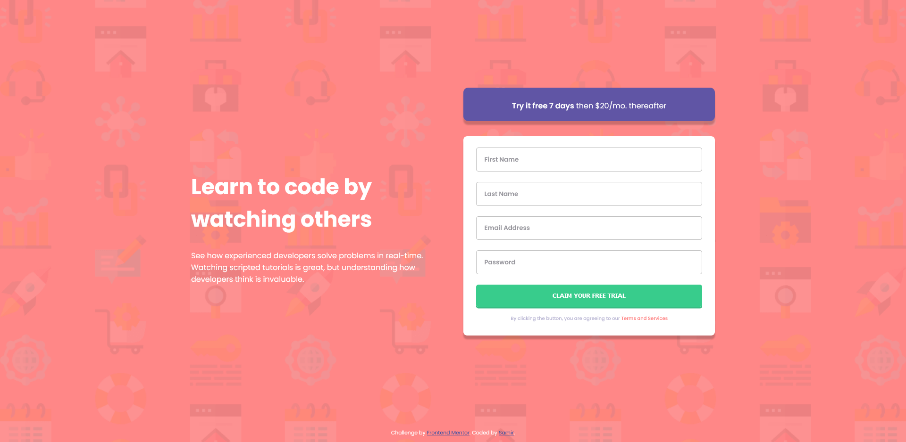
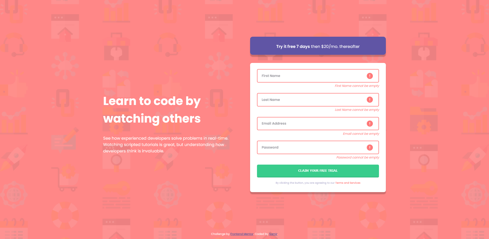

# Frontend Mentor - Intro component with sign up form solution

This is a solution to the [Intro component with sign up form challenge on Frontend Mentor](https://www.frontendmentor.io/challenges/intro-component-with-signup-form-5cf91bd49edda32581d28fd1). Frontend Mentor challenges help you improve your coding skills by building realistic projects. 

## Table of contents

- [Overview](#overview)
  - [Screenshot](#screenshot)
  - [Links](#links)
- [My process](#my-process)
  - [Built with](#built-with)
  - [What I learned](#what-i-learned)
  - [Continued development](#continued-development)
- [Author](#author)

## Overview

### Screenshot

### Links

- Solution URL: [Add solution URL here](https://your-solution-url.com)
- Live Site URL: [Add live site URL here](https://your-live-site-url.com)

## My process

### Built with

- CSS custom properties
- Flexbox
- Mobile-first workflow

### What I learned

I learned how to align items using Flexbox. I also learned to use Javascript for DOM manuppulation. 

### Continued development

I am thinking to focus on my Javascript skills and learn to use HTML5 Sematic Elements.

## Author

- Frontend Mentor - [@yourusername](https://www.frontendmentor.io/profile/samirhembrom007)
- Twitter - [@yourusername](https://twitter.com/SamirHembrom11)

